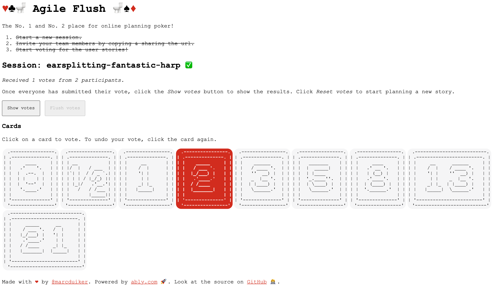

# ♥♣🚽 Agile Flush 🚽♠♦

The No. 1 and No. 2 place for online planning poker!

[](https://agileflush.ably.dev/)

This project is an example of how an online collaboration tool can be built that depends on realtime data synchronization between clients.

This is the flow diagram how users can interact with the application.


Once a planning session has started, all user actions are synchronized across all team members to maintain a consistent state. So *Show/hide votes* and *Reset votes* are triggered for all connected users once these buttons are clicked.

The live version can be used here: [Agile Flush on Azure](https://agileflush.ably.dev/).

## The tech stack


The project uses the following components:

- [Vue 3](https://v3.vuejs.org/) as the front-end framework.
- [NodeJS Azure Function](https://docs.microsoft.com/azure/developer/javascript/how-to/develop-serverless-apps) to do the authentication with Ably.
- [Ably](https://ably.com/) as the realtime communications platform.
- [Azure Static Web Apps](https://docs.microsoft.com/azure/static-web-apps/overview) to host the Vue application and NodeJS function.

## Building & running the app yourself

There are two options:

1. [Install & run locally](#1-install--run-locally)
1. [Run using GitHub Codespaces](#2-run-using-github-codespaces)

### 1. Install & run locally

#### Prerequisites

Ensure you have the following dependencies installed:

- [Node 16](https://nodejs.org/en/download/)
- [Azure Static Web Apps CLI](https://github.com/Azure/static-web-apps-cli)
- [Azure Functions Core Tools v4](https://docs.microsoft.com/azure/azure-functions/functions-run-local?tabs=v4)

For more info developing Static Web Apps locally see the [official Azure docs](https://docs.microsoft.com/azure/static-web-apps/local-development).

#### Installation steps

1. Clone this repository to your local machine.

    📝 **Tip** - If you intend you deploy your own version of the app, you're better off forking this repo.

1. To install the dependencies for this application, run this in the root of the repository:

    ```cmd
    npm run init
    ```

1. Now continue with [Running the application](#running-the-application).

### 2. Run using GitHub Codespaces

1. If you're new to Codespaces, please have a look at the [quickstart in the GitHub docs](https://docs.github.com/en/codespaces/getting-started/quickstart).

1. Create a new Codespace via the *<> Code* dropdown button and select the tab *Codespaces -> New codespace*.

1. Now continue with [Running the application](#running-the-application).

### Running the application

1. [Sign up](https://ably.com/signup) or [log in](https://ably.com/login) to ably.com, and [create a new app and copy the API key](https://faqs.ably.com/setting-up-and-managing-api-keys).

1. Add a file named `local.settings.json` to the `api` folder and add the following content:

    ```json
    {
        "IsEncrypted": false,
        "Values": {
            "AzureWebJobsStorage": "",
            "FUNCTIONS_WORKER_RUNTIME": "node",
            "ABLY_API_KEY": "<YOUR_ABLY_APP_KEY>"
        }
    }
    ```

    - Replace `<YOUR_ABLY_APP_KEY>` with the key you copied in the previous step.

1. To run everything (Vue application, Azure Function, and Static Web Apps emulator), run this in the root of the repository:

    ```cmd
    npm run all
    ```

    This command starts the Vue app at `http://localhost:3000`, the Azure Functions app at `http://localhost:7071`, and Static Web Apps at `http://localhost:4280`.

    <details>
    <summary>If these ports are already in use, please change them in the `package.json` file or start the apps individually.  </summary>

    A. To run the Vue application, run this in the root of the repository:

    ```cmd
    npm run dev
    ```

    The Vue app will be available at `http://localhost:3000`.

    B. To start the Azure Functions runtime, run this in the `api` folder of the repository:

    ```cmd
    func start
    ```

    The Azure Functions app will be available at `http://localhost:7071`.

    C. To start the Static Web App emulator, run this in the root of the repository:

    ```cmd
    swa start http://localhost:3000 --api-location http://localhost:7071
    ```

    </details>

1. Now you can use the application using the endpoint provided by the Static Web Apps emulator: `http://localhost:4280`.

## Deploying the app to Azure

Once you forked this repository, you can deploy it to Azure via:

- [the Azure Portal](https://docs.microsoft.com/azure/static-web-apps/get-started-portal?tabs=vue) or
- [the Azure CLI](https://docs.microsoft.com/azure/static-web-apps/get-started-cli?tabs=vue)

In both cases you can skip the repository creation step since you can use your fork of this repository.

## Code Tours

This repository has code tours that guide you through the files and folders in this repository. You can either start the tours in VSCode (enabled by the [CodeTour extension](https://marketplace.visualstudio.com/items?itemName=vsls-contrib.codetour)) or you start them by visiting the [github.dev](https://github.dev/ably-labs/agile-flush-vue-app) version of this repository.
