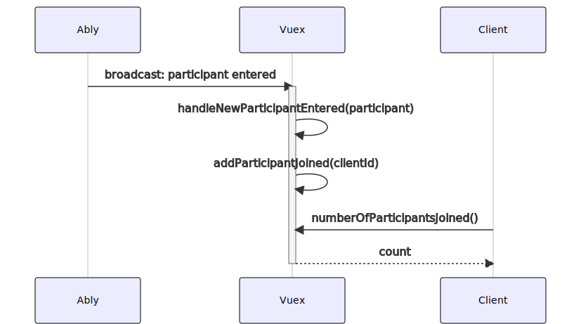
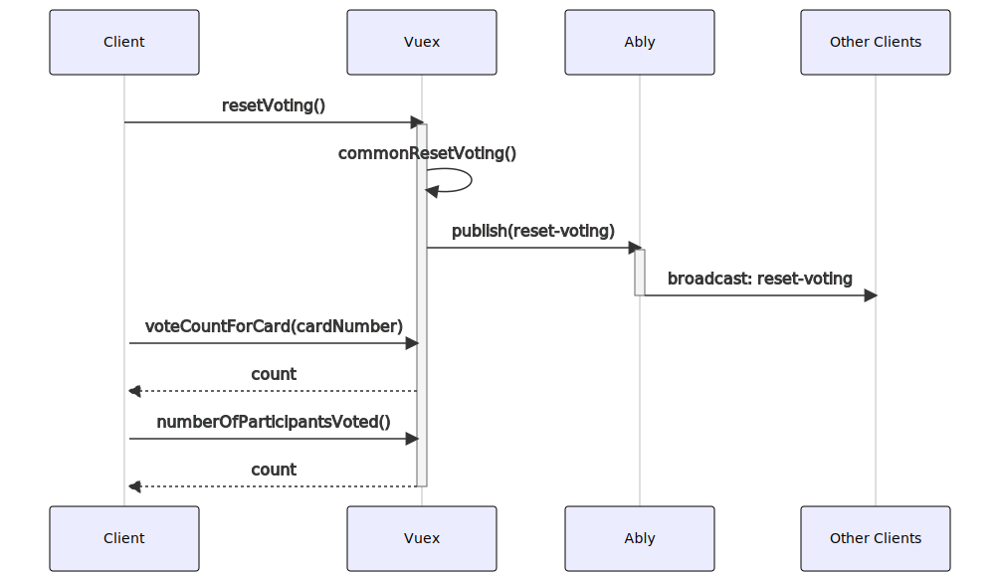
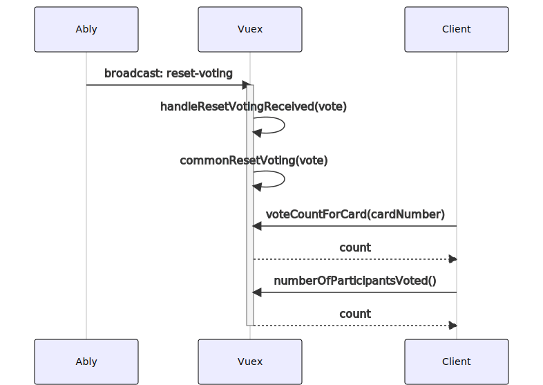

# Sequence Diagrams

## Start session

## Handle new participant entered

## Do vote

## Handle vote received

## Reset voting

## Handle reset voting received

## Toggle show results

## Handle show results received

